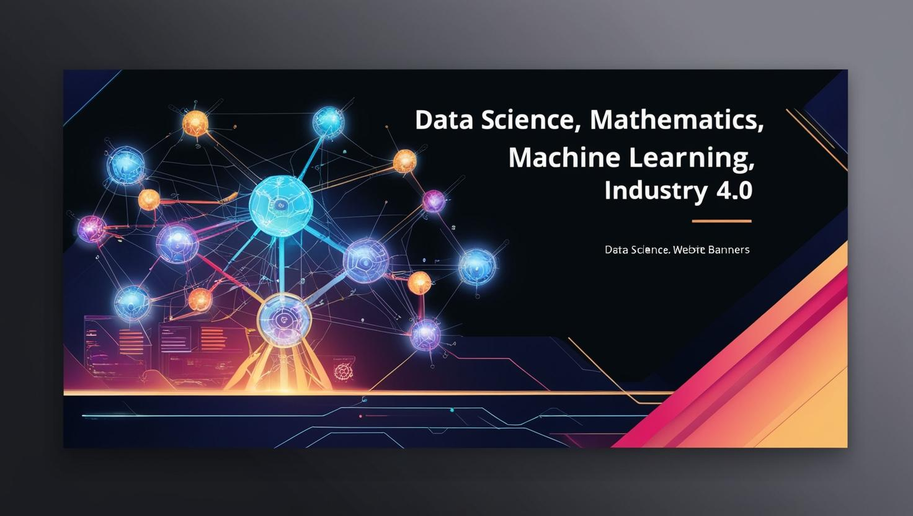

# 👋 Hello! I'm Abelardo M.

## 📌 About Me
I am a Statistician and Mathematician. My areas of expertise include:

- 🤖 Data Science, Artificial Intelligence, and Machine Learning
- 📊 Probability and Statistics
- 🔢 Reliability and Survival Analysis
- 📊 Probability and Statistics (yes, I love it so much I had to mention it twice!)

Additionally, I have conducted academic research in these fields and am a passionate programmer.

## 💻 Technologies and Tools
- **Programming Languages:** Python, R, MATLAB, Java (basic), HTML, CSS, JavaScript
- **Areas of Interest:** Data Science, Machine Learning, Full Stack Development, Big Data
- **Favorite Software and Libraries:** NumPy, Pandas, Scikit-learn, Matplotlib, ggplot2, Plotly

## 🎯 My Interests
Beyond my academic work, I am passionate about technology, artificial intelligence, and world history, especially the study of empires and civilizations. I also enjoy rock and folk music, particularly the style of *The Beatles* and *Oasis*.

## 📫 How to Reach Me?
- 📧 [Email](mailto:abelardoemc@gmail.com)
- 🔗 [LinkedIn](https://www.linkedin.com/in/tuperfil)

Thanks for visiting my profile! 🚀

